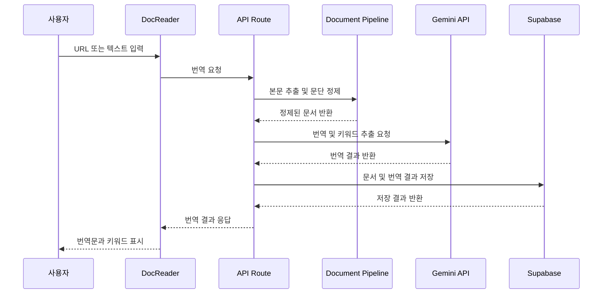

# DocsLingo

> 영문 기술 문서를 한국어로 번역하고, 핵심 키워드와 학습 흐름까지 함께 제공하는 문서 번역 서비스

DocsLingo는 공식 문서를 단순히 번역하는 것을 넘어,
실무에서 중요하게 봐야 할 문단과 키워드를 중심으로 정리해 주는 학습 보조 도구입니다.

브라우저 번역은 전체 문장을 그대로 옮겨 주지만,
긴 공식 문서를 읽을 때는 **어디가 중요한지**, **무엇을 기억해야 하는지**를 파악하기 어렵습니다.

DocsLingo는 문서 URL 또는 텍스트를 입력받아 본문을 추출하고,
중요 문단 중심의 번역과 핵심 키워드 요약을 제공합니다.

---

## 프로젝트 개요

| 항목    | 내용                                     |
| ----- | -------------------------------------- |
| 프로젝트명 | DocsLingo                              |
| 개발 기간 | 2026.06.10 ~ 진행 중                      |
| 개발 형태 | 개인 프로젝트                                |
| 주요 목적 | 영문 공식 문서의 핵심 내용을 빠르게 이해할 수 있도록 번역 및 요약 |
| 핵심 기능 | 문서 번역, 키워드 추출, 번역 히스토리, 북마크, 소셜 로그인    |

---

## 핵심 기능

### 1. URL / 텍스트 기반 문서 번역

사용자는 공식 문서 URL을 입력하거나 텍스트를 직접 붙여 넣어 번역할 수 있습니다.

URL 입력 시에는 HTML 문서에서 본문만 추출하고,
내비게이션, 광고, 푸터와 같은 불필요한 영역을 제거한 뒤 번역을 진행합니다.

```text
URL 입력
→ HTML Fetch
→ 본문 추출
→ 문단 분리
→ 중요 문단 필터링
→ AI 번역 및 키워드 추출
→ 번역 결과 저장
```

---

### 2. 핵심 키워드 추출

번역 결과와 함께 문서에서 중요한 기술 키워드를 추출합니다.

예를 들어 `App Router`, `package.json`, `Server Component`처럼
실제 개발 문서에서 자주 등장하는 개념을 짧은 설명과 함께 제공합니다.

단순 메뉴명이나 일반적인 단어는 제외하고,
학습과 실무에 도움이 되는 용어 중심으로 정리합니다.

---

### 3. 번역 히스토리

로그인한 사용자는 자신이 번역한 문서를 다시 확인할 수 있습니다.

같은 날 같은 문서를 다시 번역하는 경우에는
새로운 기록을 계속 만들지 않고 기존 기록을 갱신하도록 설계했습니다.

이를 통해 불필요한 데이터 중복을 줄이고,
사용자가 최근에 읽은 문서를 쉽게 다시 찾을 수 있도록 했습니다.

---

### 4. 북마크

중요한 문서는 북마크로 저장할 수 있습니다.

히스토리가 사용자의 최근 번역 기록이라면,
북마크는 다시 공부하고 싶은 문서를 모아두는 학습 공간입니다.

향후에는 북마크별 메모 기능을 추가해
단순 저장을 넘어 개인 학습 노트로 확장할 예정입니다.

---

### 5. 소셜 로그인 및 프로필

Google, Kakao, Naver 소셜 로그인을 지원합니다.

사용자는 닉네임과 프로필 이미지를 변경할 수 있으며,
프로필 이미지는 미리보기 후 저장 버튼을 눌렀을 때 반영되도록 구현했습니다.

---

## 기술 스택

| 구분                   | 기술                            |
| -------------------- | ----------------------------- |
| Framework            | Next.js 16, App Router        |
| Language             | TypeScript                    |
| UI                   | React 19, Tailwind CSS 4      |
| Package Manager      | Bun                           |
| Auth                 | NextAuth v5, Supabase Adapter |
| Database             | Supabase PostgreSQL           |
| Storage              | Supabase Storage              |
| Document Parsing     | Mozilla Readability, linkedom |
| AI                   | Google Gemini API             |
| Fallback Translation | MyMemory API                  |

---

## 아키텍처

컴포넌트는 Atomic Design 패턴을 기준으로 분리했습니다.

```text
src/
├── app/                    # App Router 페이지 및 API Route
│   ├── main/               # 문서 번역 메인 페이지
│   ├── profile/            # 프로필 페이지
│   ├── bookmarks/          # 북마크 페이지
│   └── api/                # BFF API Route
│
├── components/
│   ├── atoms/              # Button, Avatar, Icon 등
│   ├── molecules/          # LoginForm, KeywordSummary 등
│   ├── organisms/          # Navbar, DocReader, HistoryPanel 등
│   └── templates/          # MainTemplate, DashboardTemplate
│
├── hooks/                  # 비즈니스 로직과 상태 관리
├── services/               # 서버 로직, DB, AI 연동
├── lib/                    # 문서 파싱, AI 처리, Auth 설정
├── types/                  # 공통 타입
└── constants/              # 상수 관리
```

---

## 클라이언트 / 서버 책임 분리

컴포넌트에서 Supabase나 Gemini API를 직접 호출하지 않도록 설계했습니다.

| 구분               | 역할                        |
| ---------------- | ------------------------- |
| Server Component | 세션, 프로필 조회                |
| Client Component | 사용자 입력, UI 상태 관리          |
| Hook             | API 호출 조합, 로딩/에러 상태 관리    |
| Client Service   | 브라우저에서 API Route 호출       |
| Server Service   | DB, Storage, AI API 직접 연동 |
| API Route        | 인증 검증 후 서버 서비스 실행         |

이 구조를 통해 UI와 비즈니스 로직의 결합도를 낮추고,
인증이 필요한 로직은 서버에서 안전하게 처리하도록 했습니다.

---

## 문서 번역 요청 흐름



---

## DB 설계

Supabase는 역할별로 스키마를 분리했습니다.

| 영역          | 역할                       |
| ----------- | ------------------------ |
| `next_auth` | NextAuth 세션, OAuth 계정 관리 |
| `public`    | 프로필, 문서, 번역, 북마크 데이터     |
| `storage`   | 프로필 이미지 파일 저장            |

주요 테이블은 다음과 같습니다.

| 테이블                 | 설명              |
| ------------------- | --------------- |
| `profiles`          | 사용자 프로필 정보      |
| `profile_histories` | 닉네임, 이미지 변경 이력  |
| `documents`         | 번역 대상 문서        |
| `translations`      | 사용자별 번역 결과      |
| `bookmark_folders`  | 북마크 폴더          |
| `bookmarks`         | 사용자가 저장한 문서 북마크 |

사용자별 데이터는 RLS 정책을 적용해
본인의 번역 기록과 북마크만 조회, 수정, 삭제할 수 있도록 제한했습니다.

---

## 기술적으로 고민한 부분

### 1. AI 호출 비용 최적화

공식 문서를 그대로 AI에 전달하면 입력 토큰이 과도하게 커질 수 있습니다.

이를 줄이기 위해 문서를 문단 단위로 분리하고,
중요도가 낮은 영역을 제외한 뒤 AI에 전달하도록 설계했습니다.

또한 같은 날 같은 문서를 다시 번역하는 경우에는
새 데이터를 insert하지 않고 기존 기록을 update하도록 처리했습니다.

---

### 2. Readability 기반 본문 추출

URL 번역 기능에서는 HTML 전체를 번역하지 않고,
Mozilla Readability를 사용해 본문 영역만 추출합니다.

이를 통해 내비게이션, 광고, 푸터 같은 노이즈를 줄이고
번역 품질을 안정적으로 유지하려고 했습니다.

---

### 3. 인증과 앱 데이터 분리

NextAuth가 사용하는 인증 데이터와
서비스에서 사용하는 프로필, 번역, 북마크 데이터를 분리했습니다.

`next_auth` 스키마는 인증과 세션을 담당하고,
`public` 스키마는 서비스 도메인 데이터를 담당하도록 설계했습니다.

이를 통해 인증 구조와 서비스 로직이 섞이지 않도록 했습니다.

---

### 4. 서버 중심의 보안 처리

AI API Key, Supabase Service Role Key 등 민감한 값은
클라이언트에서 직접 접근하지 않도록 했습니다.

모든 저장, 번역, 이미지 업로드 요청은 API Route를 거쳐 처리하며,
서버에서 세션을 검증한 뒤 필요한 로직을 실행합니다.

---

## 실행 방법

### 1. 의존성 설치

```bash
bun install
```

### 2. 환경 변수 설정

`.env.local` 파일을 생성하고 아래 값을 설정합니다.

```env
# Auth
AUTH_SECRET=
AUTH_GOOGLE_ID=
AUTH_GOOGLE_SECRET=
AUTH_KAKAO_ID=
AUTH_KAKAO_SECRET=
AUTH_NAVER_ID=
AUTH_NAVER_SECRET=

# Supabase
NEXT_PUBLIC_SUPABASE_URL=
SUPABASE_SERVICE_ROLE_KEY=

# AI
GEMINI_API_KEY=
```

### 3. Supabase 스키마 실행

`supabase/schemas` 폴더의 SQL 파일을 순서대로 실행합니다.

```text
01-auth.sql
→ 02-profile.sql
→ 03-translation.sql
→ 04-bookmark.sql
→ 05-triggers.sql
→ 06-storage.sql
→ 07-rls-grants.sql
```

### 4. 개발 서버 실행

```bash
bun run dev
```

브라우저에서 아래 주소로 접속합니다.

```text
http://localhost:3000
```

---

## 앞으로 개선할 점

* 공식 문서 도메인 화이트리스트 적용
* URL 정규화 처리

  * `#hash` 제거
  * trailing slash 통일
  * `www` 여부 통일
* 동일 URL + 본문 해시 기반 번역 캐시
* 북마크 메모 작성 및 수정 기능
* 키워드 기반 복습 대시보드
* 닉네임 변경 쿨다운 및 중복 방지 정책
* 빈 본문 또는 Readability 실패 시 AI 호출 차단

---

## 프로젝트를 통해 배운 점

이 프로젝트를 통해 단순히 AI API를 호출하는 기능보다,
실제 서비스에서 AI를 어떻게 안정적으로 사용해야 하는지 고민할 수 있었습니다.

특히 다음 부분을 중점적으로 학습했습니다.

* 문서 본문 추출과 전처리 과정
* AI 입력 길이와 비용 최적화
* Next.js App Router 기반 서버/클라이언트 책임 분리
* NextAuth와 Supabase Adapter 연동
* Supabase RLS를 활용한 사용자 데이터 보호
* 번역 결과, 히스토리, 북마크로 이어지는 학습 흐름 설계

DocsLingo는 단순 번역기가 아니라,
영문 기술 문서를 더 빠르게 이해하고 다시 학습할 수 있도록 돕는 도구를 목표로 개발하고 있습니다.
