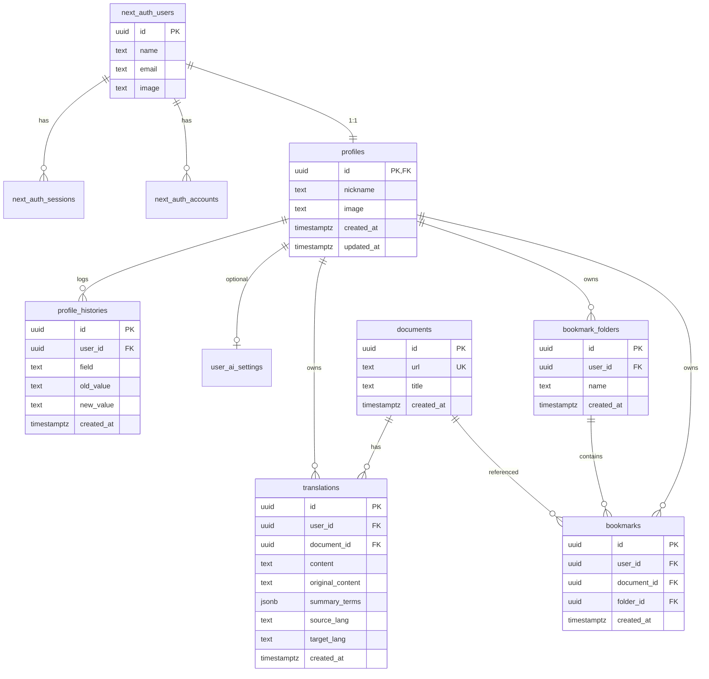
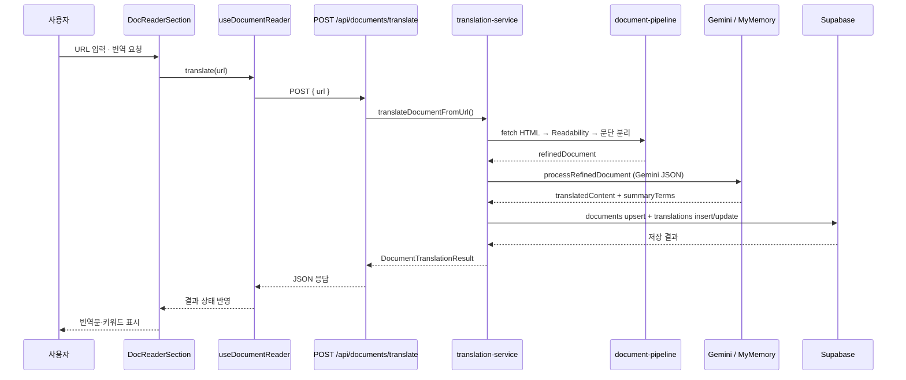
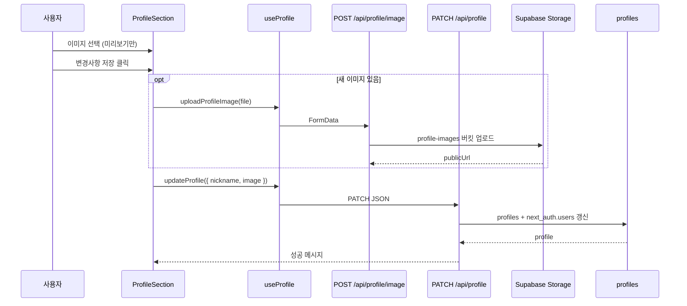

# 독스링고 (docs-ligo)

영문 기술 문서를 한국어로 번역해 주는 서비스이지만, 단순 번역기가 아닙니다.  
**현업에서 바로 쓰이는 핵심만** 골라 번역하고, **공부하기 쉬운 키워드**를 함께 제공해 실무 학습 속도를 높이는 것이 목표입니다.

공식 문서 URL 또는 직접 입력한 텍스트를 기반으로, 본문 구조를 유지한 채 번역 결과와 핵심 키워드 요약을 제공합니다.

---

## 프로젝트 기간

| 항목 | 내용 |
|------|------|
| 시작일 | 2026-06-10 |
| 현재 상태 | **진행 중 (MVP 개발)** |
| 목표 | 핵심 키워드 중심 번역 + 학습용 북마크 MVP 출시 |

---

## MVP 기획

### 목표
- 개발자가 **영문 공식 문서**를 읽을 때, 긴 본문 전체가 아니라 **현업에서 중요한 내용만** 빠르게 파악하도록 돕는다.
- AI가 **핵심 키워드**를 추출·강조해, 번역문만 읽는 것이 아니라 **공부·복습**에 바로 쓸 수 있게 한다.
- 번역 결과를 **문단·섹션 구조 그대로** 보여 준다.
- **히스토리**로 최근 본 문서를 다시 찾고, **북마크**로 더 깊게 공부하고 싶은 문서를 따로 모아 둔다.

### 서비스 차별점

| 일반 번역 | 독스링고 |
|-----------|----------|
| 전체 텍스트를 통째로 번역 | 중요 문단·섹션 위주로 정제 후 번역 |
| 번역 결과만 제공 | **핵심 키워드** 추출 + 본문 하이라이트 (코드블록·밑줄) |
| 읽고 끝 | 히스토리·**북마크**로 학습 흐름 이어가기 |
| 문서 전체가 동일한 중요도 | API·프레임워크·설정 파일 등 **현업 핵심 용어** 위주 정리 |

**한 줄 요약:** 영문 문서를 한국어로 바꿔 주면서, **지금 당장 업무·학습에 필요한 것만** 골라 공부할 수 있게 해 주는 도구.

### MVP 범위 (현재 구현 중)
- [x] URL / 텍스트 기반 문서 번역
- [x] Gemini API 번역 + MyMemory 폴백
- [x] 키워드 하이라이트 (코드블록·밑줄·섹션 라벨)
- [x] 번역 히스토리 (KST 기준 일일 중복 update)
- [x] SNS 로그인 (Google / Kakao / Naver)
- [x] 프로필 (닉네임·이미지)
- [x] 북마크 폴더·북마크 기본 구조
- [ ] 예외 사이트 처리 정책
- [ ] URL 정규화 (`#` 해시 기준 동일 페이지 인식)
- [ ] 닉네임 변경 쿨다운·중복 방지
- [ ] API 비용 절감 정책 고도화
- [ ] 북마크 메모 수정 (추후)

### MVP 이후 (확장)
- 북마크 메모 본인 수정 (학습 노트)
- 키워드·북마크 기반 **복습 대시보드**
- 닉네임 중복 검사·변경 주기 정책
- 허용/차단 도메인 화이트리스트
- 번역 품질·캐시 전략 고도화

---

## 프로젝트 개요

**독스링고**는 Readability 기반 본문 추출 → 문단 정제 → **중요도 필터** → AI 번역·키워드 추출 파이프라인으로 기술 문서를 처리합니다.

사용자는 메인 화면에서 문서 URL을 입력하거나 텍스트를 붙여 넣어 번역할 수 있습니다. 결과는 다음 두 가지로 제공됩니다.

1. **번역문** — 문단·섹션 구조를 유지한 한국어 본문 (핵심 용어는 코드블록·밑줄로 강조)
2. **키워드 요약** — `App Router`, `package.json` 등 **현업에서 자주 쓰이는 개념**만 골라 설명과 함께 정리

번역만 하고 끝나는 것이 아니라, **더 공부하고 싶은 문서는 북마크**에 담아 두고 나중에 다시 보며 학습할 수 있습니다.  
최근에 본 문서는 **히스토리**에서 빠르게 다시 열 수 있고, 같은 날 같은 문서를 재번역하면 기존 기록을 **갱신**합니다 (KST 기준).

---

## 사용 기술

| 구분 | 기술 |
|------|------|
| Framework | Next.js 16 (App Router) |
| Language | TypeScript |
| UI | React 19, Tailwind CSS 4 |
| Package Manager | Bun |
| Auth | NextAuth v5, Supabase Adapter |
| Database / Storage | Supabase (PostgreSQL, Storage) |
| 문서 추출 | Mozilla Readability, linkedom |
| AI | Google Gemini API |
| 폴백 번역 | MyMemory API |

---

## DB 아키텍처 (Supabase)

Supabase 대시보드 스키마:  
[https://supabase.com/dashboard/project/ejeslpejcurmtfpgtiyj/database/schemas](https://supabase.com/dashboard/project/ejeslpejcurmtfpgtiyj/database/schemas)

로컬 SQL 정의는 `supabase/schemas/` (01~07)에 역할별로 분리되어 있으며, 대시보드에 보이는 스키마와 동일한 구조입니다.

### 스키마 구성

| 스키마 | 역할 |
|--------|------|
| `next_auth` | NextAuth 세션·OAuth 계정 (Auth.js Adapter) |
| `public` | 프로필, 문서, 번역, 북마크 등 앱 데이터 |
| `storage` | 프로필 이미지 파일 (`profile-images` 버킷) |

### ER 다이어그램



### 테이블 상세

#### `next_auth` (01-auth.sql)
| 테이블 | 설명 |
|--------|------|
| `users` | SNS 로그인 사용자 (Auth.js) |
| `sessions` | 세션 토큰 |
| `accounts` | OAuth provider 연동 정보 |
| `verification_tokens` | 이메일 인증 토큰 |

> 설치 후 **Project Settings → Data API → Exposed schemas**에 `next_auth` 추가 필요

#### `public` (02~04)
| 테이블 | 설명 |
|--------|------|
| `profiles` | 앱 프로필 (닉네임·이미지), `users.id`와 1:1 |
| `profile_histories` | 닉네임·이미지 변경 이력 (트리거 자동 기록) |
| `user_ai_settings` | 사용자별 Gemini API 키 (UI 제거, DB 유지) |
| `documents` | 번역 대상 문서 (`url` UNIQUE) |
| `translations` | 사용자별 번역 결과·원문·키워드(JSON) |
| `bookmark_folders` | 북마크 폴더 |
| `bookmarks` | 문서 북마크 (user + document UNIQUE) |

#### 트리거 (05-triggers.sql)
| 트리거 | 동작 |
|--------|------|
| `on_auth_user_created` | `users` INSERT 시 `profiles` 자동 생성 |
| `on_profile_updated` | `profiles` UPDATE 시 `profile_histories` 기록 + `updated_at` 갱신 |

#### Storage (06-storage.sql)
| 버킷 | 설명 |
|------|------|
| `profile-images` | 프로필 아바타 (public, 5MB, jpg/png/webp/gif) |

#### RLS 정책 (07-rls-grants.sql)
- `profiles`: 전체 조회 가능, 본인만 수정
- `translations` / `bookmarks` / `bookmark_folders`: **본인 데이터만** CRUD
- `documents`: 전체 조회, 인증 사용자 insert
- 서버 API Route는 **`service_role`** 로 RLS 우회하여 저장 처리

### SQL 실행 순서
```
01-auth.sql → 02-profile.sql → 03-translation.sql → 04-bookmark.sql
→ 05-triggers.sql → 06-storage.sql → 07-rls-grants.sql
```

---

## 프론트엔드 아키텍처

### 레이어 구조 (Atomic Design)

```
src/
├── app/                        # App Router (페이지·API)
│   ├── page.tsx                # 랜딩 / 로그인
│   ├── main/                   # 문서 번역 메인
│   ├── profile/                # 개인정보 변경
│   ├── bookmarks/              # 북마크
│   └── api/                    # BFF API Route
│
├── components/
│   ├── atoms/                  # Button, Avatar, Icon, Logo ...
│   ├── molecules/              # LoginForm, KeywordSummary, ProfileAvatar ...
│   ├── organisms/              # Navbar, DocReader, ProfileSection, HistoryPanel ...
│   └── templates/              # MainTemplate, DashboardTemplate
│
├── hooks/                      # useDocumentReader, useProfile, useTranslationHistory
├── services/                   # translation-service, profile-service (서버)
│                               # translation-client-service (클라이언트 fetch)
├── lib/
│   ├── document-pipeline/      # fetch → Readability → split → filter
│   ├── document-ai-processor.ts
│   ├── gemini-client.ts
│   └── auth.ts
├── types/
└── constants/
```

### 페이지 ↔ 컴포넌트 매핑

| 페이지 | Template | 주요 Organism |
|--------|----------|---------------|
| `/` | `MainTemplate` | `LoginSection`, `BrandSection` |
| `/main` | `DashboardTemplate` | `DocReaderSection`, `TranslationHistoryPanel` |
| `/profile` | `DashboardTemplate` | `ProfileSection` |
| `/bookmarks` | `DashboardTemplate` | (북마크 UI) |

### 클라이언트 / 서버 분리 원칙

| 구분 | 위치 | 역할 |
|------|------|------|
| **Server Component** | `app/**/page.tsx` | 세션·프로필 조회, SEO Metadata |
| **Client Component** | `components/**` (`"use client"`) | 폼·번역 UI·상태 |
| **Hook** | `hooks/` | fetch 조합, 로딩·에러 상태 |
| **Client Service** | `*-client-service.ts` | 브라우저 → API Route 호출 |
| **Server Service** | `services/` | DB·AI·Storage 직접 연동 |
| **API Route** | `app/api/` | 인증 검증 후 Service 호출 (BFF) |

> 컴포넌트 내부에서 Supabase/Gemini를 **직접 호출하지 않음**

---

## 요청 흐름 (Flow)

### 1. 문서 번역 (URL)



**파이프라인 상세 (`lib/document-pipeline/`)**
```
URL
 → fetch-html.ts
 → extract-readability.ts (Mozilla Readability)
 → extract-linked-section-headings.ts (h1/h2 앵커 제목)
 → split-paragraphs.ts (문단 분리)
 → filter-importance.ts (중요도·길이 제한)
 → prepare-ai-input.ts
 → document-ai-processor.ts (Gemini)
 → saveTranslation (KST 일일 중복 시 update)
```

### 2. 프로필 저장



### 3. 번역 히스토리 조회

```
useTranslationHistory
  → GET /api/translations/history
  → translation-service.getTranslationHistory()
  → Supabase translations JOIN documents
  → TranslationHistoryPanel (앨범 UI)
```

### 4. 인증

```
SNS 로그인 버튼
  → NextAuth (/api/auth/[...nextauth])
  → Supabase Adapter (next_auth 스키마)
  → signIn 이벤트 → syncUserProfile()
  → 트리거 handle_new_user() → profiles 생성
```

---

## 주요 기능

### 1. 문서 번역 + 핵심 키워드 추출
- **URL 번역**: HTML fetch → Readability 본문 추출 → 문단 분리 → 중요도 필터 → AI 번역
- **텍스트 번역**: 사용자가 붙여 넣은 원문 직접 번역
- 링크가 걸린 섹션 제목(`h1`/`h2`) 기준 문단 구분
- **현업 핵심 키워드** 자동 추출 (API명, 프레임워크 용어, 설정 파일 등)
- 번역문 내 키워드 강조 (`<u>`, 백틱, 섹션 라벨 bold) — **읽으면서 바로 공부**
- 내비게이션·목차용 일반 단어(API Reference, Overview 등)는 키워드에서 제외

### 2. 번역 히스토리
- 로그인 사용자별 번역 기록 앨범 UI
- **최근에 본 문서**를 빠르게 다시 열기
- **KST 기준 같은 날** 동일 문서는 insert 대신 **update**

### 3. 북마크 (학습 큐레이션)
- **더 공부하고 싶은 문서**를 폴더별로 저장
- 반복 조회용 히스토리와 달리, **의도적으로 모아 두는 학습 목록**
- 폴더 단위 북마크 구조 (DB 스키마 준비, 메모 수정은 추후)

### 4. 인증·프로필
- Google / Kakao / Naver 소셜 로그인
- 닉네임 변경
- 프로필 이미지 (선택 후 **변경사항 저장** 시 반영)

---

## 시작하기

### 1. 의존성 설치
```bash
bun install
```

### 2. 환경 변수 (`.env.local`)
```env
# Auth
AUTH_SECRET=
AUTH_GOOGLE_ID=
AUTH_GOOGLE_SECRET=
AUTH_KAKAO_ID=
AUTH_KAKAO_SECRET=
AUTH_NAVER_ID=
AUTH_NAVER_SECRET=

# Supabase
NEXT_PUBLIC_SUPABASE_URL=
SUPABASE_SERVICE_ROLE_KEY=

# AI
GEMINI_API_KEY=
```

### 3. Supabase 스키마
`supabase/schema.sql` 가이드에 따라 `schemas/01-auth.sql` ~ `07-rls-grants.sql` 순서로 실행합니다.  
프로필 이미지 업로드를 쓰려면 **`06-storage.sql`** 실행이 필요합니다.

### 4. 개발 서버
```bash
bun run dev
```

브라우저에서 [http://localhost:3000](http://localhost:3000) 접속

---

## 처리 예정 사항 (에러·정책)

아래 항목은 MVP 이후 반영·보완이 필요한 정책입니다.

### 1. 공식 문서가 아닌 사이트 예외 처리
**문제**  
블로그, 뉴스, 마케팅 페이지 등 비공식 문서는 Readability 추출 품질이 낮거나 번역 가치가 떨어질 수 있습니다.

**처리 방향**
- 허용 도메인 화이트리스트 (예: `nextjs.org`, `react.dev`, `developer.mozilla.org`)
- 비허용 도메인은 번역 전 안내 메시지 반환
- 추후 관리자 설정 또는 `robots`/메타 기반 2차 판별 검토

---

### 2. 히스토리 URL 동일 페이지 인식 (`#` 해시)
**문제**  
`https://nextjs.org/docs` 와 `https://nextjs.org/docs#how-to-use-the-docs` 는 **같은 페이지**이지만, 현재는 URL 문자열 전체로 `documents.url`을 구분할 수 있습니다.

**처리 방향**
- 저장·중복 판별 전 URL **정규화**
  - `hash(#...)` 제거 후 비교
  - trailing slash, `www.` 등도 통일
- KST **하루 1건** 정책은 정규화된 URL 기준으로 update

```ts
// 예시 정책
normalizeDocumentUrl("https://nextjs.org/docs#how-to-use-the-docs")
// → "https://nextjs.org/docs"
```

---

### 3. 닉네임 변경 기준
**문제**  
닉네임을 자주 바꾸면 DB 히스토리·중복 검사 부담이 커집니다.

**처리 방향**
- **최소 3일** 간격이 지나야 닉네임 변경 허용
- `profile_histories` 테이블에 변경 이력 축적
- **중복 닉네임 방지** (UNIQUE 또는 변경 시 검증)
- 확장 시: 부적절 닉네임 필터, 변경 횟수 제한

---

### 4. API 호출 최소화·비용 절감 정책
**현재 적용**
- 문단 **중요도 필터**로 AI 입력 길이 제한 (`MAX_PARAGRAPHS_FOR_AI`, `MAX_AI_INPUT_LENGTH`)
- KST 기준 **일일 동일 문서 update**로 불필요한 insert 방지
- Gemini 실패 시에만 MyMemory 폴백

**추가 검토**
- 동일 URL+본문 해시 **번역 캐시** (24시간)
- 섹션 단위 번역 vs 전체 번역 트레이드오프
- Readability 실패·빈 본문 시 AI 호출 차단
- 모델 자동 선택·저비용 모델 우선 정책 명문화

---

### 5. 북마크 메모 본인 수정 (추후 기능)
**문제**  
북마크 시 남긴 메모를 이후에 수정·삭제할 수 없습니다.

**처리 방향**
- `bookmarks` 테이블에 `memo` 컬럼 추가 (또는 별도 테이블)
- 북마크 상세·목록 UI에서 **본인만** 수정/삭제 가능 (RLS)
- 수정 이력은 MVP 이후 선택 적용

---

## 라이선스

Private project.
