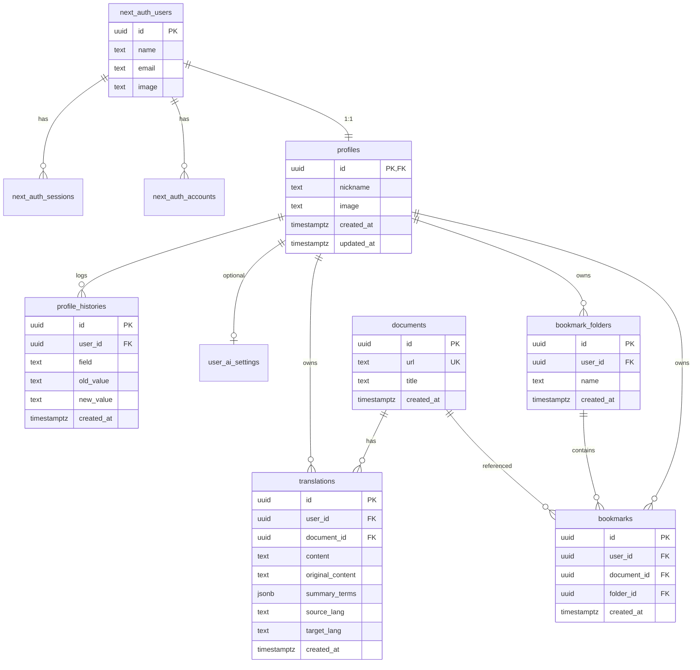
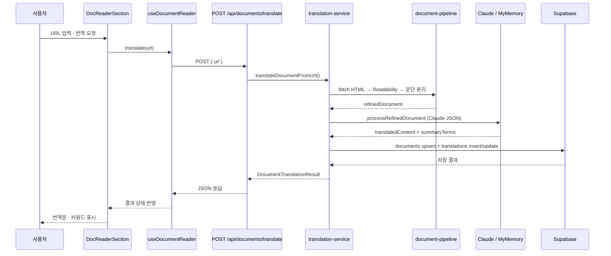
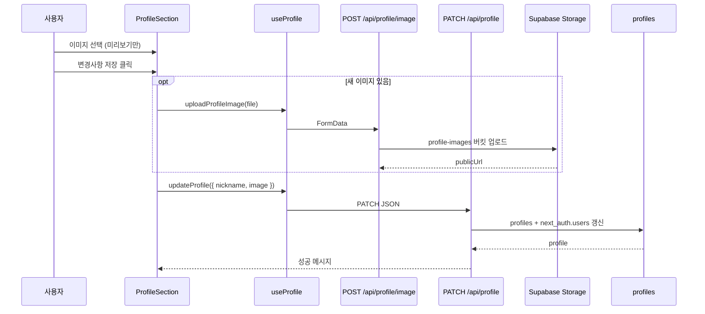

# 독스링고 (docs-ligo)

**독스 링고**는 영문 기술 문서를 한국어로 번역해 주는 서비스입니다.  
사실 번역만 놓고 보면 브라우저 번역으로도 충분합니다.  
그런데 공식 문서를 그렇게 읽다 보면 어디가 중요한지 모른 채 긴 글을 처음부터 읽다가 중간에 포기하게 되는 경우가 많습니다.  
그래서 독스링고는 문서를 통째로 옮기는 대신 **실무에서 자주 쓰이는 내용 위주로 추려서 번역**하고, **같이 보면 좋은 핵심 키워드를 함께 정리**해 줍니다.  
번역문을 읽으면서 자연스럽게 "**이 문서에서 뭘 가져가면 되는지**"까지 잡히는 것이 목표입니다.  

사용법은 간단합니다.  
문서 URL을 넣거나 텍스트를 붙여 넣으면 원문 구조를 유지한 번역과 키워드 요약이 나옵니다.  
더 공부하고 싶은 문서는 북마크에 모아 두고, 최근에 본 문서는 히스토리에서 다시 열 수 있습니다.

---

## 프로젝트 로드맵

| 단계 | 내용 | 기간 | 상태 |
|------|------|------|------|
| 1단계 | MVP 개발 | 2026.06.10 ~ | 진행 중 |
| 2단계 | 예외 처리 · 정책 보완 | 미정 | 예정 |
| 3단계 | 추가 기능 개발 | 미정 | 예정 |

### 1단계 — MVP 개발 (진행 중)

서비스의 뼈대를 만드는 단계입니다. "번역 + 키워드 + 학습 흐름"이라는 핵심 경험이 한 바퀴 돌아가는 것이 목표입니다.

- [x] URL / 텍스트 기반 문서 번역
- [x] Claude API 번역 + MyMemory 폴백
- [x] 키워드 하이라이트 (코드블록 · 밑줄 · 섹션 라벨)
- [x] 번역 히스토리 (KST 기준, 같은 날 동일 문서는 update)
- [x] SNS 로그인 (Google / Kakao / Naver)
- [x] 프로필 (닉네임 · 이미지)
- [x] 북마크 폴더 · 북마크 기본 구조
- [x] 공식 문서 여부 검증 및 안내 메시지
- [x] URL hash 제거 · 동일 페이지 중복 판별

### 2단계 — 예외 처리 · 정책 보완

기능이 "동작하는 것"과 "운영할 수 있는 것"은 다르다고 생각합니다. MVP가 돌아간 뒤에는 실제 사용 과정에서 생기는 엣지 케이스를 다듬습니다.

- [ ] 공식 문서 판별 정책 고도화 (관리자 허용/차단 도메인, 메타 정보 기반 2차 판별)
- [ ] URL 정규화 고도화 — trailing slash, `www.`, 추적용 query 정리
- [ ] 닉네임 변경 쿨다운(최소 3일) · 중복 방지
- [ ] API 비용 절감 정책 고도화 (번역 캐시, 저비용 모델 우선 선택 등)

### 3단계 — 추가 기능 개발

학습 도구로서의 정체성을 강화하는 단계입니다.

- [ ] 북마크 메모 작성 · 수정 (나만의 학습 노트)
- [ ] 키워드 · 북마크 기반 복습 대시보드
- [ ] 허용/차단 도메인 관리 기능
- [ ] 번역 품질 · 캐시 전략 고도화

---

## 일반 번역과 무엇이 다른가요

| | 일반 번역 | 독스링고 |
|---|-----------|----------|
| 번역 범위 | 전체 텍스트를 통째로 | 중요 문단 · 섹션 위주로 정제 후 번역 |
| 결과물 | 번역문만 | 번역문 + 핵심 키워드 + 본문 하이라이트 |
| 읽은 후 | 읽고 끝 | 히스토리 · 북마크로 학습 흐름이 이어짐 |
| 용어 처리 | 모든 문장이 같은 무게 | API명 · 프레임워크 용어 · 설정 파일 등 현업 핵심 용어를 강조 |

한 줄로 정리하면, **영문 문서를 한국어로 바꿔 주면서 지금 당장 업무와 학습에 필요한 것만 골라 공부할 수 있게 해 주는 도구**입니다.

---

## 어떻게 동작하나요

독스링고의 번역은 단순히 텍스트를 AI에 넘기는 방식이 아니라, 여러 단계의 파이프라인을 거칩니다.

```
URL
 → HTML fetch
 → Mozilla Readability 본문 추출
 → 섹션 제목(h1/h2) 인식
 → 문단 분리
 → 중요도 필터 (AI 입력 길이 제한)
 → Claude 번역 + 키워드 추출
 → 저장 (KST 기준 일일 중복 시 update)
```

본문 추출 단계에서 내비게이션, 광고, 푸터 같은 노이즈를 걸러내고, 중요도 필터로 핵심 문단만 AI에 전달합니다. 덕분에 번역 품질이 안정적이고 API 비용도 절약됩니다.

결과는 두 가지로 제공됩니다.

1. **번역문** — 문단과 섹션 구조를 원문 그대로 유지한 한국어 본문. 핵심 용어는 코드블록과 밑줄로 강조되어 읽으면서 바로 눈에 들어옵니다.
2. **키워드 요약** — `App Router`, `package.json`처럼 현업에서 자주 쓰이는 개념만 골라 짧은 설명과 함께 정리합니다. 목차나 메뉴에 쓰이는 일반 단어(API Reference, Overview 등)는 키워드에서 제외합니다.

---

## 주요 기능

### 문서 번역 + 핵심 키워드 추출

URL을 입력하면 본문을 추출해 번역하고, 텍스트를 붙여 넣으면 그대로 번역합니다. 링크가 걸린 섹션 제목(`h1`/`h2`)을 기준으로 문단을 구분하기 때문에 원문의 흐름이 깨지지 않습니다. 번역과 동시에 현업 핵심 키워드가 자동으로 추출되고, 본문 안에서도 백틱과 밑줄로 강조됩니다.

### 번역 히스토리

로그인하면 내가 번역한 문서들이 앨범 형태로 쌓입니다. 최근에 본 문서를 빠르게 다시 열 수 있고, 같은 날(KST 기준) 같은 문서를 다시 번역하면 새 기록을 만들지 않고 기존 기록을 갱신합니다.

### 북마크 — 학습 큐레이션

히스토리가 "지나온 길"이라면 북마크는 "다시 돌아올 곳"입니다. 더 깊게 공부하고 싶은 문서를 폴더별로 의도적으로 모아 둘 수 있습니다. 메모 작성 기능은 다음 단계에서 추가할 예정입니다.

### 인증 · 프로필

Google, Kakao, Naver 소셜 로그인을 지원합니다. 닉네임과 프로필 이미지를 변경할 수 있고, 이미지는 미리보기 후 "변경사항 저장"을 눌렀을 때 반영됩니다.
로그인 세션은 한국 시간(KST) 기준 날짜가 바뀌는 자정에 자동 만료됩니다. JWT의 `exp`와 앱에서 사용하는 `sessionExpiresAt`을 같은 값으로 맞추기 때문에, 사용자가 직접 로그아웃하지 않아도 다음 날 00:00이 지나면 서버 세션 검증에서 차단되고 열린 화면에서는 Navbar 타이머가 `/api/auth/signout`으로 이동시켜 로그아웃을 완료합니다.

---

## 사용 기술

| 구분 | 기술 |
|------|------|
| Framework | Next.js 16 (App Router) |
| Language | TypeScript |
| UI | React 19, Tailwind CSS 4 |
| Package Manager | Bun |
| Auth | NextAuth v5, Supabase Adapter |
| Database / Storage | Supabase (PostgreSQL, Storage) |
| 문서 추출 | Mozilla Readability, linkedom |
| AI | Google Claude API |
| 폴백 번역 | MyMemory API |

---

## DB 아키텍처 (Supabase)

로컬 SQL 정의는 `supabase/schemas/` 폴더에 01~07번으로 역할별로 분리되어 있으며, Supabase 대시보드에 보이는 스키마와 동일한 구조입니다.

스키마는 세 영역으로 나뉩니다.

| 스키마 | 역할 |
|--------|------|
| `next_auth` | NextAuth 세션 · OAuth 계정 (Auth.js Adapter) |
| `public` | 프로필, 문서, 번역, 북마크 등 앱 데이터 |
| `storage` | 프로필 이미지 파일 (`profile-images` 버킷) |

### ER 다이어그램



### 테이블 구성

**`next_auth` (01-auth.sql)** — Auth.js가 사용하는 영역입니다. `users`(SNS 로그인 사용자), `sessions`(세션 토큰), `accounts`(OAuth provider 연동), `verification_tokens`(이메일 인증)로 구성됩니다.

> 설치 후 **Project Settings → Data API → Exposed schemas**에 `next_auth`를 추가해야 합니다.

**`public` (02~04)** — 앱의 실제 데이터가 쌓이는 영역입니다.

| 테이블 | 설명 |
|--------|------|
| `profiles` | 앱 프로필 (닉네임 · 이미지), `users.id`와 1:1 |
| `profile_histories` | 닉네임 · 이미지 변경 이력 (트리거가 자동 기록) |
| `user_ai_settings` | 사용자별 Claude API 키 (UI는 제거, DB만 유지) |
| `documents` | 번역 대상 문서 (`url` UNIQUE) |
| `translations` | 사용자별 번역 결과 · 원문 · 키워드(JSON) |
| `bookmark_folders` | 북마크 폴더 |
| `bookmarks` | 문서 북마크 (user + document UNIQUE) |

**트리거 (05-triggers.sql)** — 사용자가 가입하면 `profiles`가 자동 생성되고(`on_auth_user_created`), 프로필이 수정되면 변경 이력이 자동으로 기록됩니다(`on_profile_updated`).

**Storage (06-storage.sql)** — `profile-images` 버킷에 프로필 아바타를 저장합니다. (public, 5MB, jpg/png/webp/gif)

**RLS 정책 (07-rls-grants.sql)** — 데이터 접근 권한을 DB 레벨에서 통제합니다.

- `profiles`: 누구나 조회 가능, 수정은 본인만
- `translations` / `bookmarks` / `bookmark_folders`: 본인 데이터만 CRUD
- `documents`: 전체 조회 가능, 인증 사용자만 insert
- 서버 API Route는 `service_role`로 RLS를 우회해 저장을 처리

### SQL 실행 순서

```
01-auth.sql → 02-profile.sql → 03-translation.sql → 04-bookmark.sql
→ 05-triggers.sql → 06-storage.sql → 07-rls-grants.sql
```

---

## 프론트엔드 아키텍처

컴포넌트는 Atomic Design 패턴으로 구성했습니다.

```
src/
├── app/                        # App Router (페이지 · API)
│   ├── page.tsx                # 랜딩 / 로그인
│   ├── main/                   # 문서 번역 메인
│   ├── profile/                # 개인정보 변경
│   ├── bookmarks/              # 북마크
│   └── api/                    # BFF API Route
│
├── components/
│   ├── atoms/                  # Button, Avatar, Icon, Logo ...
│   ├── molecules/              # LoginForm, KeywordSummary, ProfileAvatar ...
│   ├── organisms/              # Navbar, DocReader, ProfileSection, HistoryPanel ...
│   └── templates/              # MainTemplate, DashboardTemplate
│
├── hooks/                      # useDocumentReader, useProfile, useTranslationHistory
├── services/                   # translation-service, profile-service (서버)
│                               # translation-client-service (클라이언트 fetch)
├── lib/
│   ├── document-pipeline/      # fetch → Readability → split → filter
│   ├── document-ai-processor.ts
│   ├── claude-client.ts
│   └── auth.ts
├── types/
└── constants/
```

### 페이지 ↔ 컴포넌트 매핑

| 페이지 | Template | 주요 Organism |
|--------|----------|---------------|
| `/` | `MainTemplate` | `LoginSection`, `BrandSection` |
| `/main` | `DashboardTemplate` | `DocReaderSection`, `TranslationHistoryPanel` |
| `/profile` | `DashboardTemplate` | `ProfileSection` |
| `/bookmarks` | `DashboardTemplate` | (북마크 UI) |

### 클라이언트 / 서버 분리 원칙

역할별로 책임을 명확히 나눠서, 컴포넌트가 Supabase나 Claude를 직접 호출하는 일이 없도록 했습니다.

| 구분 | 위치 | 역할 |
|------|------|------|
| Server Component | `app/**/page.tsx` | 세션 · 프로필 조회, SEO Metadata |
| Client Component | `components/**` (`"use client"`) | 폼 · 번역 UI · 상태 |
| Hook | `hooks/` | fetch 조합, 로딩 · 에러 상태 |
| Client Service | `*-client-service.ts` | 브라우저 → API Route 호출 |
| Server Service | `services/` | DB · AI · Storage 직접 연동 |
| API Route | `app/api/` | 인증 검증 후 Service 호출 (BFF) |

---

## 기술적으로 고민한 부분

### 1. AI 호출 비용 최적화

공식 문서를 그대로 AI에 전달하면 입력 토큰이 과도하게 커질 수 있습니다.

이를 줄이기 위해 URL 번역은 `refine-document.ts`에서 HTML fetch → Readability 본문 추출 → 문단 분리 → 중요도 필터 순서로 문서를 정제한 뒤 AI에 전달하도록 설계했습니다.

중요도 필터는 `filter-importance.ts`에서 문단 길이, 제목 형태, 코드/API/SDK 같은 기술 키워드 포함 여부를 점수화합니다. 반대로 `cookie`, `newsletter`, `privacy policy`, `table of contents`처럼 번역 가치가 낮은 영역은 감점합니다. 최종적으로 `MAX_PARAGRAPHS_FOR_AI = 40`, `MAX_AI_INPUT_LENGTH = 10000` 제한 안에서 핵심 문단만 선택합니다.

또한 같은 날(KST 기준) 같은 사용자가 같은 문서를 다시 번역하는 경우에는 새 데이터를 insert하지 않고 기존 `translations` 기록을 update합니다. 문서 URL은 hash를 제거해 저장하고, `getPageKey()` 기준으로 같은 페이지 후보를 비교해 중복 저장을 줄였습니다.

### 2. Readability 기반 본문 추출

URL 번역 기능에서는 HTML 전체를 번역하지 않고, `Mozilla Readability`를 사용해 본문 영역만 추출합니다.

`extract-readability.ts`는 `linkedom`으로 HTML을 DOM 형태로 만든 뒤 Readability를 실행하고, 추출된 `textContent`만 이후 문단 분리와 중요도 필터에 넘깁니다. 이를 통해 내비게이션, 광고, 푸터 같은 노이즈를 줄이고 번역 품질을 안정적으로 유지하려고 했습니다. Readability 결과가 비어 있거나 중요 문단이 남지 않으면 AI를 호출하지 않고 `DOCUMENT_EMPTY` 오류로 중단합니다.

### 3. 번역 품질 일관성

문서마다 출력 형식이 흔들리지 않도록 Claude 구조화 프롬프트는 `한 줄 요약`, `문서 구조`, `핵심 요약`, `핵심 용어`, `코드 예제 설명`, `주의할 점` 순서로 결과를 만들게 고정했습니다.

특히 Next.js 공식 문서처럼 루트 개요 페이지, 디렉터리 구조 설명 페이지, 기능별 가이드 페이지가 섞여도 먼저 `documentStructure`로 문서 흐름을 3~6개 항목으로 정리하고, 그다음 실제 의사결정에 필요한 핵심 내용과 키워드를 분리합니다. `summary-consistency.test.js`는 `nextjs.org/docs`, `project-structure`, `fonts` URL이 모두 마크다운 후보를 만들고, 프롬프트/매핑 코드가 같은 출력 계약을 유지하는지 확인합니다.

### 4. 인증과 앱 데이터 분리

NextAuth가 사용하는 인증 데이터와 서비스에서 사용하는 프로필, 번역, 북마크 데이터를 스키마 단위로 분리했습니다.

`next_auth` 스키마는 NextAuth Supabase Adapter가 사용하는 `users`, `sessions`, `accounts`, `verification_tokens`를 담당하고, `public` 스키마는 `profiles`, `documents`, `translations`, `bookmark_folders`, `bookmarks` 같은 서비스 도메인 데이터를 담당합니다.

로그인 사용자는 `next_auth.users`에 저장되고, 앱에서 사용하는 닉네임·이미지는 `profiles`에서 관리합니다. 가입 시에는 DB 트리거가 프로필을 만들고, 애플리케이션에서는 `syncUserProfile()`로 소셜 프로필 정보를 동기화합니다. 덕분에 인증 구조와 서비스 로직이 한 테이블에 섞이지 않습니다.

### 5. KST 자정 기준 자동 로그아웃

세션 만료는 단순히 로그인 시각 + 24시간으로 계산하지 않고, `session-expiration.ts`에서 한국 시간 기준 다음 자정 epoch seconds를 계산해 JWT의 `sessionExpiresAt`에 저장합니다. NextAuth JWT 자체 만료값인 `exp`도 같은 값으로 맞춰 JWT와 앱 세션 기준이 갈라지지 않게 처리했습니다. 12시간 뒤 자동 로그아웃은 `resolveSessionExpiresAt()`의 `maxAgeSeconds` 옵션으로 적용할 수 있지만, 기본 동작은 KST 자정 만료입니다.

서버에서는 `auth.ts`와 `auth-config.ts`가 `sessionExpiresAt <= now`인지 검사해 만료된 JWT가 API Route나 보호 페이지를 통과하지 못하게 막습니다. 클라이언트에서는 `Navbar`가 같은 `sessionExpiresAt` 값을 받아 타이머를 걸고, 자정이 지나면 `/api/auth/signout`으로 이동해 브라우저 세션도 정리합니다.

동작 검증은 `npm run test:auth`로 기록했습니다. 테스트는 자정 정각 로그인, 자정 1초 전 로그인, 자정 1초 후 로그인, 만료 시각 직전/정각 판정을 확인합니다. 전체 `tsc`와 `lint`는 현재 로컬 Node가 `C:\Users\Develop` 상위 경로를 `lstat`하는 과정에서 권한 오류가 발생해 실행이 막히므로, 별도 권한 정리 후 다시 확인해야 합니다.

### 6. 서버 중심의 보안 처리

AI API Key, Supabase Service Role Key, Storage 업로드 권한 같은 민감한 값은 클라이언트에서 직접 접근하지 않도록 했습니다.

모든 저장, 번역, 이미지 업로드 요청은 `/api/documents/translate`, `/api/profile/image`, `/api/bookmarks` 같은 API Route를 거쳐 처리합니다. 브라우저의 client service는 API Route만 호출하고, 실제 DB·AI·Storage 연동은 서버 service에서 담당합니다.

각 API Route는 먼저 `auth()`로 세션을 검증한 뒤 필요한 로직을 실행합니다. 예를 들어 번역 API는 로그인 여부, URL/text 동시 입력 여부, URL 형식, 공식 문서 여부를 서버에서 검증한 뒤 `translateDocumentFromUrl()` 또는 `translateDocumentFromText()`를 호출합니다. Supabase 저장은 `getSupabaseAdminClient()`가 서버 환경 변수의 `SUPABASE_SERVICE_ROLE_KEY`로 만든 admin client를 통해 수행합니다.

---

## 요청 흐름 (Flow)

### 1. 문서 번역 (URL)



### 2. 프로필 저장



### 3. 번역 히스토리 조회

```
useTranslationHistory
  → GET /api/translations/history
  → translation-service.getTranslationHistory()
  → Supabase translations JOIN documents
  → TranslationHistoryPanel (앨범 UI)
```

### 4. 인증

```
SNS 로그인 버튼
  → NextAuth (/api/auth/[...nextauth])
  → Supabase Adapter (next_auth 스키마)
  → signIn 이벤트 → syncUserProfile()
  → 트리거 handle_new_user() → profiles 생성
```

---

## 시작하기

### 1. 의존성 설치

```bash
bun install
```

### 2. 환경 변수 (`.env.local`)

```env
# Auth
AUTH_SECRET=
AUTH_GOOGLE_ID=
AUTH_GOOGLE_SECRET=
AUTH_KAKAO_ID=
AUTH_KAKAO_SECRET=
AUTH_NAVER_ID=
AUTH_NAVER_SECRET=

# Supabase
NEXT_PUBLIC_SUPABASE_URL=
SUPABASE_SERVICE_ROLE_KEY=

# AI
ANTHROPIC_API_KEY=
```

### 3. Supabase 스키마

`supabase/schema.sql` 가이드에 따라 `schemas/01-auth.sql`부터 `07-rls-grants.sql`까지 순서대로 실행합니다. 프로필 이미지 업로드를 사용하려면 `06-storage.sql` 실행이 필요합니다.

### 4. 개발 서버

```bash
bun run dev
```

브라우저에서 [http://localhost:3000](http://localhost:3000)에 접속합니다.

---

## 운영하며 고민 중인 것들

만들면서 마주친 문제들과, 2~3단계에서 풀어 가려는 방향을 기록해 둡니다.

### 공식 문서가 아닌 사이트는 어떻게 할까

블로그, 뉴스, 마케팅 페이지처럼 비공식 문서는 Readability 추출 품질이 낮거나 번역할 가치가 떨어질 수 있습니다. 현재는 `validateOfficialDocumentUrl()`에서 공식 문서 패턴과 비공식 문서 패턴을 먼저 검사하고, npm/PyPI 메타데이터의 homepage·repository 링크까지 확인해 공식 문서 여부를 판별합니다. 통과하지 못한 URL은 번역 전에 안내 메시지를 보여 주고 AI 호출을 막습니다.

이후에는 관리자 설정으로 허용/차단 도메인을 관리하거나, 문서 메타 정보 기반의 2차 판별을 추가하는 방향을 검토하고 있습니다.

### 같은 페이지인데 URL이 다르게 저장되는 문제

`https://nextjs.org/docs`와 `https://nextjs.org/docs#how-to-use-the-docs`는 같은 페이지지만, URL 문자열 전체로만 비교하면 다른 문서처럼 저장될 수 있습니다. 현재는 `normalizeDocumentUrl()`로 hash(`#...`)를 제거해 저장하고, `getPageKey()`로 origin + pathname + 정렬된 query를 비교해 같은 페이지 후보를 찾습니다. KST 하루 1건 update 정책도 이 문서 row를 기준으로 동작합니다.

아직 trailing slash, `www.` 통일, 추적용 query 제거 같은 정규화는 더 보완할 수 있습니다.

```ts
// 예시 정책
normalizeDocumentUrl("https://nextjs.org/docs#how-to-use-the-docs")
// → "https://nextjs.org/docs"
```

### 닉네임 변경 정책

닉네임을 자주 바꾸면 변경 이력과 중복 검사 부담이 커집니다. 최소 3일 간격이 지나야 변경할 수 있게 하고, `profile_histories`에 이력을 쌓으면서 중복 닉네임도 막을 계획입니다. 이후에는 부적절 닉네임 필터나 변경 횟수 제한까지 확장할 수 있습니다.

### API 비용을 어떻게 줄일까

지금도 몇 가지 장치가 들어가 있습니다. Readability 실패나 중요 문단이 없는 경우에는 AI 호출 전에 중단하고, 문단 중요도 필터로 AI 입력 길이를 제한합니다(`MAX_PARAGRAPHS_FOR_AI`, `MAX_AI_INPUT_LENGTH`). 같은 날 같은 문서는 insert 대신 update하고, Claude가 실패했을 때만 MyMemory로 폴백합니다.

여기에 더해 동일 URL + 본문 해시 기준의 24시간 번역 캐시, 저비용 모델 우선 선택 정책 같은 것들을 검토하고 있습니다.

### 북마크 메모 수정

지금은 북마크에 남긴 메모를 나중에 수정하거나 지울 수 없습니다. `bookmarks` 테이블에 `memo` 컬럼을 추가하고, RLS로 본인만 수정·삭제할 수 있게 할 예정입니다. 북마크가 단순 저장이 아니라 "나만의 학습 노트"가 되는 것이 목표입니다.

---
